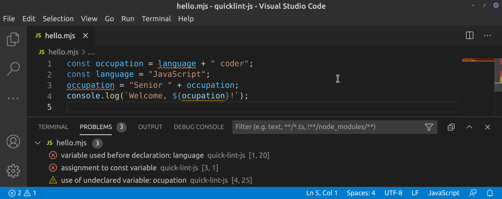

# quick-lint-js

quick-lint-js finds bugs in JavaScript programs.

**Warning**: This is pre-release software. quick-lint-js is under active
development and is unstable. Use at your own risk.

quick-lint-js finds many bugs, including:

* Using a variable which does not exist
* Assigning to a `const` variable
* Using `await` in a non-`async` function
* Syntax errors

## Building

### Without CMake (macOS and Linux only)

    $ c++ -o quick-lint-js -std=gnu++17 -I src -I vendor/boost -I vendor/simdjson/include -I vendor/simdjson/src -D_LIBCPP_HIDE_FROM_ABI_PER_TU_BY_DEFAULT=1 -D_LIBCPP_INLINE_VISIBILITY="__attribute__((internal_linkage))" src/*.cpp vendor/boost/libs/container/src/*.cpp vendor/boost/libs/container/src/alloc_lib.c vendor/simdjson/src/simdjson.cpp
    $ ./quick-lint-js path/to/my-file.js

### With CMake

See [build instructions](docs/BUILDING.md) for how to build quick-lint-js for
development.

## Values

* **Performance**. You use quick-lint-js in text editors and IDEs to show bugs
  as they are written. quick-lint-js must be *fast* to make feedback *responsive*.
  * **Small design**. The less infrastructure and developer conveniences used
    within quick-lint-js, the less time quick-lint-js wastes due to this bloat.
  * **Few features**. Features add run-time costs. With fewer features,
    quick-lint-js gives you feedback sooner.

* **High signal**. quick-lint-js finds bugs, not nitpicks. You can use
  quick-lint-js in *any* project, no matter the size or style.
  * **No opinions**. quick-lint-js doesn't complain about style issues, like
    using `'strings'` vs `"strings"`. It complains about real bugs which
    everyone agrees are bugs.
  * **No false positives**. If quick-lint-js complains, you know it's a bug in
    your code.
  * **No configuration**. quick-lint-js works out-of-the-box. You don't need
    configuration files to tell quick-lint-js what buggy code looks like.
